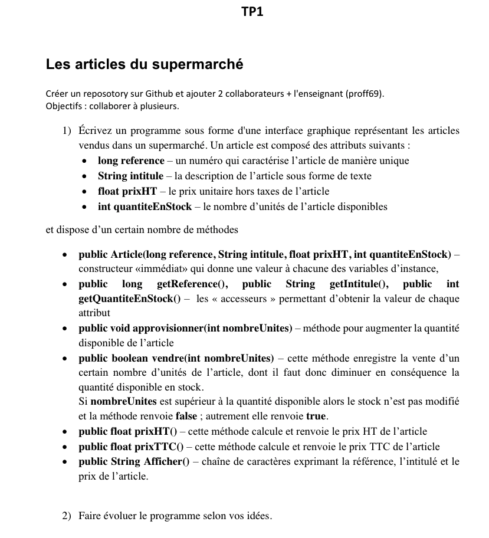

# java-automobile


[](https://github.com/semantic-release/semantic-release)

**Contexte** : 

### 0. Lancement

#### This uses following libraries/frameworks
- Swing 
- Hibernate 
- H2 Database 

Bien lancer le projet depuis le dossier `src/` avec eclipse, intellij ou la commande suivante :

> open JDK > 13 est requis

```
cd src/ && javac main.java.Main.java && java main.java.Main
```

### 1. Swing

- [Layouts](http://zetcode.com/javaswing/swinglayoutmanagement/)

### 2. Modules internes

#### Framework MVC

Chacun des **view / model / controller** correspondent à la gestion d'une entité. On retrouve CarController / Car(Model) et CarView

> Le Controller se charge de gérer la création des modules Model et Vue. Il faut donc dans un contrôleur bien avoir une propriété correspondant à la vue associée. Ainsi nous conservons une référence vers la vue pour par exemple récupérer les données de formulaire.

Pour donner de la structure à notre projet nous séparons nos opérations en trois parties qui communiquent entre elles. 
- **La vue** : On créer avec des modules Swing des composants graphiques et des formulaires. La vue appelle un service Layout central conservant la `mainFrame`  soit la fenêtre visuelle correspondant à notre logiciel.

- **Le contrôleur** : Vrai métronome des interactions (dans les deux sens) entre le model et la vue. Il est instancié en premier et appelle la vue correspondante pour l'afficher à l'utilisateur. Il a également accès au registre des services et donc peut récupérer tous les instances d'objets utiles comme le `Layout`  et l' `EntityManager` .

- **Le model** : correspond aux objets représentants les entités de notre projet comme le `Car`, ou le `Client`. Ils sont accessibles au travers du service EntityManager . Ce service permet de gérer les opérations CRUD dans la base de données sur une entité spécifique.

## Registre de service

Dans ce pseudo framework tout les objets qui transite dans les différents Contrôleurs sont des **services** et implémentent l'interface `Framework.Service` . Un service non `load` déclenche une erreur qui peut être fatale pour le fonctionnement de l'application.

Voici les méthodes obligatoires d'un service si jamais vous avez besoin de créer le votre...
```java
    @Override
    public void load() {
        loaded = true;
    }

    @Override
    public boolean isLoaded() {
        return loaded;
    }
``` 

> Petite doc de l'api des services depuis un controller

- `this.getRegistery()` pour récupérer le registre complet
- `this.getService()` pour récupérer un service, attention si vous voulez récupérer une classe particulière il faut bien casté l'instance Framework.Service vers celle de votre classe avec par exemple: 
```java
// C'est un exemple cela n'est pas conseillé
(Layout) ly = this.getService('layout'); 
```
Pour récupérer les services particuliers du `entityManager` et du layout dans un contrôleur

```java
// Faites plutôt un
this.getLayout(); // pour récupérer une classe Layout

// Pour un entity Manager Proxy d'un certaine entité
EntityManagerPrixy car = this.getEntityManagerProxy(Article.class);
``` 

#### l'entity manager proxy

Ce service permet la récupération et la sauvegarde sur la base de données.
Il s'agit d'un proxy pour communiquer avec la session hibernate qui s'occupe des différents états de persistence en base de donnée.

```java
// On le récupère dans un controlleur comme cela
EntityManagerProxy car = this.EntityManagerProxy(Article.class);
// ou (moins conseillé car non conservé en registre)
EntityManagerProxy car = new EntityManagerProxy(Article.class);
```

Il contient ces méthodes

`persist` : Ajout ou mise à jour d'une instance à la base

`getAll` : récupérer la liste des entités

`getById` : Récupérer une entité par son id

##### Création d'une entité

Voici les **méthodes** clés d'une entité 

`toString(boolean list)` : Pour récupérer les propriétés dans une liste en les séparant par des virgules. Utile pour créer des vue tableau des données d'entités.

#### Le cas du service Layout : 

Le service Layout créer avec les composants swing nous permet de gérer la pageBtn d'accueil et donc de créer des liens vers les pages.
Il est indispensable dans connexion des vues avec le fenêtre principale grâce à sa propriété `mainFrame` qui est un accès direct à l'objet.

Voici les propriété du service layout : 
```java
    public CardLayout card = new CardLayout();
    public Home home = new Home();
    public View.MenuBar menuBar = new MenuBar();
``` 

- `card` correspond à l'organisation de la pageBtn d'accueil, il permet de switcher entre les vues

- `home`  regroupe les différentes pages de l'accueil que 'on référence dans une View

- `menuBar` est pas très utilisé mais correspond au menu en haut à gauche. 

#### Le form builder :

Pour créer rapidement un formulaire simple on peut utiliser le module `View.SwingModules.FormBuilder;`

Le builder est compatible avec tous les composants Swing tels que :
- `JComboBox` (Pour les select)
- `JButton`
- `JTextField`
- `JLabel`
- ...

L'objectif est d'instancier un des composants swing dans notre classe et de les ajouter dans le builder au fur et à mesure.
Le builder est composé au fur et à mesure pour inscrire des champs dans un layout grid bag à une colomne.
> Il est prévu plus tard de pouvoir choisir d'autres possibilté de layout avec plusieurs colomnes

On commence ainsi un builder de cette façon :

> Attention : il est conseiller de définir les composants swing en variables de classe
> pour pouvoir ensuite récupérer leurs valeurs dans le controleur.

```java
FormBuilder builder = new FormBuilder(false); // Ce boolean en param désactive la création automatique de labels
// On peut chainer les configurations
builder.add('NomLabel', new JLabel("Nom"))
       .add('Nom', new JTextField(20))
       .add('JButton', new JButton('button'))
       .disableListButton() // Désactive le boutons pour aller sur la vue liste d'une entité
       .disableSubmitButton() // Pas de submission de ce formulaire
       .disableBackButton() // Pas de retour en arrière;

// Ensuite pour récupérer le panel à attacher à la window
builder.getPanel();

// Si on veut aussi gérer un cas d'erreur on peut faire un
builder.errorDialog(exception.getMessage());
```

Les évênements sur les boutons :

Lorsque l'on clique sur un bouton de formulaire, des fonctions vont être automatiquemment lancées, par exemple sur un formulaire `submit()` est déclenché et appelé de partout là ou on écoute la fonction. C'est une fonction correspondante à un listener java, ainsi on peut en déclencher une autre sur plusieurs classes quand celle-ci survient : 

> Voir Exemple dans la vue client

```java
// Utilisez avec un formulaire buildé
Form.submit(e -> { // ici le code déclenché au submit, en général validation et ajout des données })

Form.list(e -> { // ici le code déclenché au listing d'entités, On récupère bien les données avant de la ajouté à la vue Swing })
``` 

> Il peut être utile d'appeler des donneés dans ces méthodes lors de la création de JCombobox (cf `OrderController` et `OrderView`)
> Logiquement elles sont déjà appélées dans la View correspondante d'une entié (OrderView), mais pour la récupération de donnée, il est quand même préférable de les stocker 
dans une propriété du constructeur et d'après les récupérées de la vue...

### Pour les pages du services home :
Les pages sont les boutons cliquables qui redirigent vers un autre espace.
Des Pages peuvent se trouver à l'accueil mais aussi imbriqués dans d'autres pages

On a une fonction pour récupérer une page :

> Utilisez des constantes pour bien récupérer la page voulu

- `this.getLayout().home.page(Home.PRODUCTS)`

### 3. Git

Merge vs rebase :


Staging area &rarr; repo local &rarr; remote


### Git flow

- On `merge squash` toujours une branche de feature dans la develop
- On **rebase** toujours la `develop` dans la `prod` pour release

`my-branch --> develop (master) --> prod`

### Commandes

```sh
# Bases
git status # Consulter l'état de la staging area
git diff # Consulter les modifs, ajouter --staged si les fichiers ont étés git add 
git add -A # Ajouter tous les fichiers modifiés et nouveaux dans le prochaint commit
git commit -m "" # Placer tous les fichiers ready (en vert) dans un commit
git remote -v # Voir les remotes distantes liés à notre remote locale
git log -10 # historique des commit (-10 = en voir que 10)

# Utiles...
# Stocker vos modifications courantes avant de mettre à jour la branche
git stash 
# remettre dans la staging area ce que vous avez sauvegarder avec git stash
git stash pop

# Décomposition du checkout d'une version
# et de la mise à jour d'une branche
git fetch origin master
git checkout origin/master
git branch ma-branche
git checkout ma-branche
# Ou sinon tout d'un coup
git fetch origin master:ma-branche && git checkout ma-branche

# Pour mettre à jour :
(être bien checkout sur ma branche)
git fetch origin master
git rebase origin/master
# Equivalent à :
git pull  origin master --rebase

# Si vous travailler sur la même branche que quelqu'un
git pull --rebase # (récupère automatiquement et rebase la branche courrante)

# Quand on veut repartir de la bonne version en écrasant tout :
git fetch --all
git reset --hard origin/master

# Quand on est en conflit, une fois résolu via un IDE :
git add -A
git rebase --continue

# Commandes avancées

# reset seulement le README à la version sur origin/master
git checkout origin/master -- README.md
# Modifier l'historique jusqu'au 2 derniers commits
git rebase -i HEAD~2
# Ajouter un commit à son historique courante
git cherry-pick <hash-commit>

```
